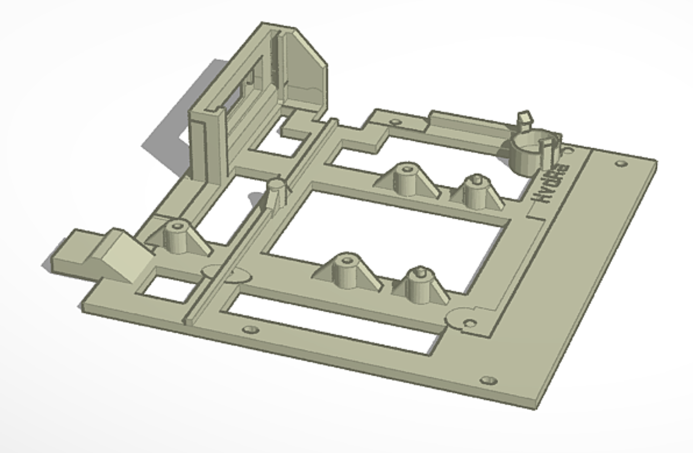

# Amiga Shifting
## Amiga 1000 and Amiga A1010 3.5" Gotek Drive Mount STL File

This was created to give the gotek a stealth look in the Amiga 1000 and 1010 drive when printing with a matching color. No cutting or case modification is needed. In fact with no USB key installed, the case looks stock at first. If you get a slim nano type drive, it is very stealth when in use.

These directions and STL file are provided as is, and no responsibility is assumed on the fitness of the directions or any other information provided.

### Needed Parts
- OLED Screen: 0.91" 128x32 Character I2C IIC Serial OLED LCD Screen Module 4-PIN DC 3.3V 5V.
- Speaker: Approximately 12 x 9mm/0.46 x 0.35inch (DxH) and 5v of the Piezo PC Beeper type.
- Gotek: Standard 3.5" 1.44M SFR1M44-U100K that have the LED Digits.
- PLA Filament: MakerBot, 1.75 mm Diameter, Large Spool, Warm Gray

### Build Steps
- Remove the board and then from there desolder the green LED light and replace it with a 2 pin header for existing Amiga LED harness.
- OLED can be wired up using the existing cable for the LED harness.
- Screws are re-used from the inside of the Gotek to attach to the printed frame.
- Jumper placed on S0

*This is based on the work of https://www.thingiverse.com/thing:2098110*

#### Attribution-NonCommercial-NoDerivatives 4.0 International
  

Please see the LICENSE file for details, what this means is you may download the works and share them with others as long as you credit me, but you can’t change the work in any way or use my work commercially.

